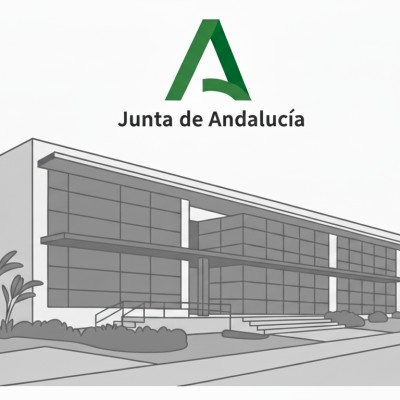

&nbsp;&nbsp;&nbsp;&nbsp;&nbsp;&nbsp;&nbsp;&nbsp;&nbsp;&nbsp;&nbsp;&nbsp;

# Trabajos Fin de Máster - Curso 2025 / 2026

En este repositorio se encuentra centralizada toda la información relativa a los **Trabajos Fin de Máster del Curso de Especialización en Inteligencia Artificial y Big Data del CPIFP Alan Turing**, en la convocatoria del curso 2025-2026.

## Índice

* [Relación de Trabajos Fin de Máster](#id1)
* [Requisitos y criterios](#id2)
* [Código y documentación a entregar](#id3)
* [Fechas a tener en cuenta](#id4)
* [Cuadrante horario de las exposiciones](#id5)
* [Lugar de las exposiciones](#id6)
* [Evaluación del TFM](#id7)

## Relación de Trabajos Fin de Máster

Cada grupo debe cumplimentar la siguiente tabla:

| Grupo | Primer integrante           |     Segundo integrante               |         Tercer integrante         |         Cuarto integrante    | Título del TFM (enlazado al repositorio) |
|:-----:|:---------------------------:|:------------------------------------:|:---------------------------------:|:----------------------------:|:----------------------------------------:|
|   1   |  Carlos Cerezo López        |    Victor Jiménez Guerrero           |    Enrique Moreno Alcántara       |   Denisa Ramona Belean       |        [PawSense](https://github.com/denibel04/PawSense)                        |
|   2   |  Ismael Sihammou Anahnah    |    Juan francisco Chacón Macías      |    Ismael Guerrero Martín         |                              |        [StyleMePal](https://github.com/TFM-OUTFIT-IA/stylemepal)                        |
|   3   |   Elías Robles Ruíz         |    Cristina Vacas López              |        Ruyi Xia Ye                |                              | [SmartEatAI](https://github.com/SmartEatAI/smart-eat-ai) |
|   4   | Alejandro Barrionuevo Rosado   | Alvaro López Guerrero             |   Andrei Munteanu Popa            |                              | [LatencyZero](https://github.com/Latency-Zero-tfm/LatencyZero) |
|   5   |   Antonio Delgado Rodríguez   |  Manuel Dueñas Cortés  |  Alejandro Gálvez Madueño   |   Jesús Herrera Sánchez  |        [InnerWork](https://github.com/InnerWorkAI)                        |

## Requisitos y criterios

El proyecto se realiza en grupos de tres o cuatro alumnos/as elegidos por sorteo. La nota del trabajo será la nota de cada uno de los alumnos.

El Trabajo de Fin de Máster consiste en la realización de un proyecto de Inteligencia Artificial y Big Data en el que se apliquen los conocimientos adquiridos durante el curso a un caso de uso real.

Además de las herramientas y tecnologías estudiadas durante la formación, el alumnado puede hacer uso de técnicas y/o aplicaciones novedosas que no se hayan visto en clase. Esto no exhime del cumplimiento de ninguno de los requisitos que se detallan más abajo.

Se deben incluir los siguientes apartados:

1. Justificación y descripción del proyecto.
2. Obtención de datos. Se debe especificar la fuente de los datos. Se indicará por qué medios se han obtenido (encuestas, sensores, scrapping, etc.). Los datos se deben cargar en una estructura que permita su posterior manipulación y uso.
3. Limpieza de datos (eliminación de nulos y datos erróneos, etc.). Descripción de los datos. Se debe dar una descripción completa de los datos indicando qué significa cada uno de los atributos.
4. Exploración y visualización de los datos. Se realizará un estudio de los datos buscando correlaciones, mostrando gráficas de diferente tipología, observando si hay valores nulos, etc.
5. Preparación de los datos para los algoritmos de Machine Learning. Se deben tratar los datos (limpiando, escalando, separando y todo lo que sea necesario) de tal forma que queden listos para entrenar el modelo.
6. Entrenamiento del modelo y comprobación del rendimiento.  Se entrenarán uno o varios modelos, comprobando en cada caso el rendimiento que ofrecen mediante las apropiadas medidas de error y/o acierto.
7. Se tiene que incluir alguna de las técnicas estudiadas en el tema de Procesamiento de Lenguaje Natural: expresiones regulares, tokenización, generación de texto, análisis de sentimientos, etc.
8. Se debe realizar también una aplicación web que haga uso del modelo entrenado.
9. La inclusión en el proyecto de IA agéntica es opcional, no obstante, se valorará positivamente su uso.
10. Conclusiones. Se expondrán las conclusiones que se han obtenido en la realización del TFM.

Se pueden usar modelos preentrenados para alguna/s sección/es del trabajo. Pero eso no exhime de la preparación, entrenamiento y uso de modelos de ML como se ha visto en clase.

## Código y documentación a entregar

Todo el material debe estar incluido o enlazado en el repositorio del TFM de cada grupo.

El repositorio debe contener lo siguiente:
  * Título
  * Descripción
  * Código fuente
  * Presentación en formato PDF. Se puede utilizar como apoyo para la exposición cualquier otro formato de presentación pero es obligatorio incluir siempre la presentación en PDF en el repositorio.
  * Enlace a la aplicación web.
  * Recursos utilizados (procedencia de los datos, manuales o tutoriales consultados, etc.).
  * Vídeo de 10 minutos máximo, donde el grupo exponga brevemente su proyecto y muestre su funcionamiento. Es muy importante hacer una introducción diciendo el nombre de la aplicación y de qué trata en una frase, antes de pasar a los detalles técnicos. El vídeo debe estar subido a Youtube y enlazado desde el repositorio de GitHub.
  * Archivo (independiente o texto dentro del README) en el que se indique explícitamente el porcentaje que le corresponde a cada miembro del trabajo realizado de dicho proyecto. En caso de 3 integrantes, el 33% se considerará como 1/3. Deberéis consensuarlo. Os pedimos que seáis justos y coherentes con el trabajo del resto de compañeros.

## Fechas a tener en cuenta

* Sorteo de parejas y explicación del TFM: miércoles 18 de diciembre de 2025.
* Fecha límite de creación del repositorio del TFM con el título, el punto 1 de los requisitos (justificación y descripción) y enlazado en este repositorio-índice: lunes 16 de febrero de 2026.
* Fecha límite para subir todo el material que se pide sobre el TFM: viernes 6 de marzo de 2026 a las 23:59h.
* Exposiciones generales: lunes 9 de marzo de 2026.

## Cuadrante horario de las exposiciones

La duración de cada exposición será de 20 minutos (15 de exposición y 5 de preguntas), dejando un margen de otros 5 minutos para el cambio. Todos los alumnos deberán estar presentes desde el principio de las exposiciones.

### :calendar: lunes 9 de marzo de 2026

* 09:30h - 09:50h - Grupo 1
* 09:55h - 10:15h - Grupo 2
* 10:20h - 10:40h - Grupo 3
* 10:45h - 11:05h - Grupo 4
* 11:10h - 11:30h - Grupo 5

## 📍 Lugar de las exposiciones

<!--
Las exposiciones tendrán lugar en el [Centro Andaluz de Innovación en FP](https://maps.app.goo.gl/E9HEBZgV5SaQmExNA) sita en C/ Severo Ochoa, 21, 29590, PTA (Málaga).
-->
Las exposiciones tendrán lugar en [Accenture](https://maps.app.goo.gl/E9HEBZgV5SaQmExNA) sita en C/ Pierre Laffitte, 6
29590 Málaga.

<!--
## 🗓️  🚧 🏗️ 👷‍♂️ PERIODO EXTRAORDINARIO: Fechas a tener en cuenta

Para el alumnado que no haya superado la fase inicial.

* Comienzo del proyecto: lunes 17 de marzo de 2026
* Fecha límite de creación del repositorio del TFM con el título, el punto 1 de los requisitos (justificación y descripción) y enlazado en este repositorio-índice: lunes 17 de marzo de 2026
* Fecha límite para subir todo el material que se pide sobre el TFM: domingo 26 de mayo de 2026 a las 23:59h
* Exposiciones generales: lunes 26 de mayo a las 12:45h
* Duración: 20 minutos.

| Nombre completo           |  Título del TFM enlazado al repositorio   |
|:-------------------------:|:-----------------------------------------:|
|                           |   [Título]()                              |

-->

## 📝 Evaluación del TFM

Se tendrá en cuenta en la nota el porcentaje que cada grupo haya asignado a cada uno de sus integrantes para repartir la calificación.

<!--
Para la elección de los tres mejores proyectos que se expondrán a Accenture se tienen en cuenta los votos de los alumnos de forma individual con un 30% de peso y los votos de los profesores con un 70% de peso. Un alumno no puede votar por su propio equipo.
-->

:star: Si te ha gustado este repo, dale una estrellita :wink:
